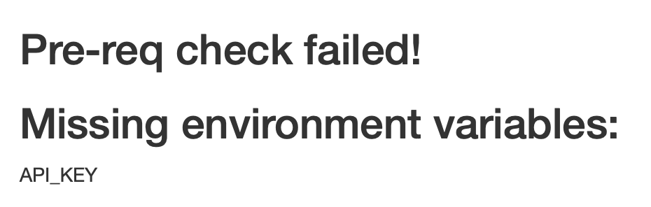

# shinyprereqs

<!-- badges: start -->
[](https://lifecycle.r-lib.org/articles/stages.html#experimental)
<!-- badges: end -->

The goal of shinyprereqs is to provide a mechanism by which shiny
applications can be published directly from git (using git-backed 
publishing on RStudio Connect for example), without having to have
all of the pre-requisites for the app available at deploy time.

For instance, if you publish an app that needs an environment variable
to be set in order to work properly, the first publish of that app
will leave it in a broken state while you figure out what went wrong
and rectify it.

## Installation

You can install the dev version of shinyprereqs from GitHub with:

``` r
remotes::install_github("sellorm/shinyprereqs")
```

## Current status

The package is experimental and currently only supports checking for
environment variables.

## Using shinyprereqs

The pre-requisites tests that `shinyprereqs` runs are driven by
a single config file.

You can generate a skeleton file by running the following in your
shiny app directory:

```r
library(shinyprereqs)
use_prereqs()
```

The skeleton file, `shiny_prereqs.yml`, will look something like this:

```yaml
env_vars:
  - MY_ENV_VAR
  - MY_API_KEY
```

Say you have an app that relies on the environment variable
`API_KEY` being set. You'd edit the file to reflect the specific 
environment variables you want to test for. So it would end up 
looking like this:

```yaml
env_vars:
  - API_KEY
```

Then, in your Shiny app's `app.R` file, you need to make a couple 
of minor changes.

Add the following to the top of the file somewhere:

```r
library(shinyprereqs)
```

And at the end of the file, change this:

```r
shinyApp(ui = ui, server = server)
```

to this:

```r
shinyApp(ui = prereq_ui(ui), 
         server = prereq_server(server))
```

Now, when you run the app, if the `API_KEY` environment variable
is not set, your app will display something like this:



But if you set the `API_KEY` environment variable your app will 
display normally.

In essence, if the pre-requisites checks fail for any reason, your 
app will be replaced by the error report app, which shows you 
what's missing.

## Complete Example

This is a complete example app (the classic RStudio example app using
geyser data!) that demonstrates the simple changes required to make 
it work with `shinyprereqs`. Notice that we've only added the 
additional line to load the library and then slightly modified the 
final `shinyApp( )` line.

```r
#
# This is a Shiny web application. You can run the application by clicking
# the 'Run App' button above.
#
# Find out more about building applications with Shiny here:
#
#    http://shiny.rstudio.com/
#

library(shiny)
library(shinyprereqs)

# Define UI for application that draws a histogram
ui <- fluidPage(

    # Application title
    titlePanel("Old Faithful Geyser Data"),

    # Sidebar with a slider input for number of bins 
    sidebarLayout(
        sidebarPanel(
            sliderInput("bins",
                        "Number of bins:",
                        min = 1,
                        max = 50,
                        value = 30)
        ),

        # Show a plot of the generated distribution
        mainPanel(
           plotOutput("distPlot")
        )
    )
)

# Define server logic required to draw a histogram
server <- function(input, output) {

    output$distPlot <- renderPlot({
        # generate bins based on input$bins from ui.R
        x    <- faithful[, 2]
        bins <- seq(min(x), max(x), length.out = input$bins + 1)

        # draw the histogram with the specified number of bins
        hist(x, breaks = bins, col = 'darkgray', border = 'white')
    })
}

# Run the application 
shinyApp(ui = prereq_ui(ui), 
         server = prereq_server(server))
```

If you save the above as `app.R` and create the skeleton
`shiny_prereqs.yml` config file in the same directory with
`use_prereqs()`, this geyser app will be replaced with the 
error report app when you try to run it. If you set the 
appropriate environment variables before trying to run it 
again, the geyser app will run normally.

## Important note

Because of the way that shiny apps are started inside the RStudio 
IDE, changing an environment variable will not be picked up if you 
use the "Reload App" button. Apps must be fully stopped before 
restarting using the "Run App" button.

## License

MIT © Mark Sellors
